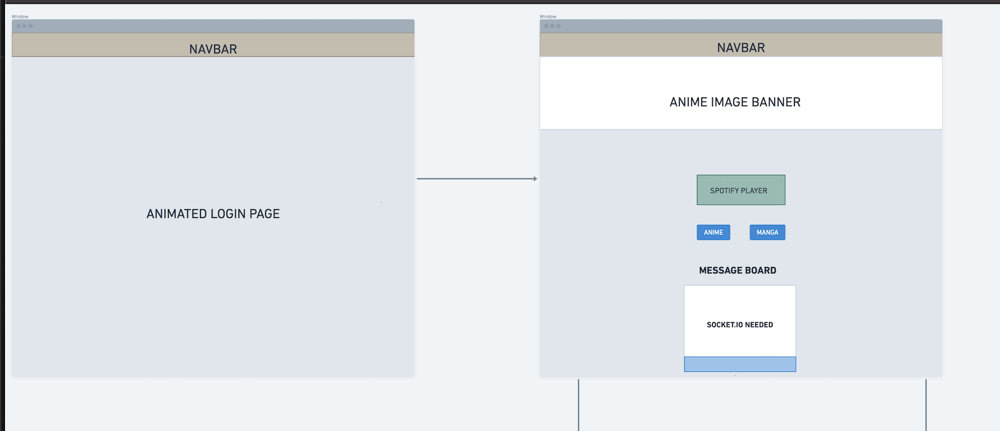
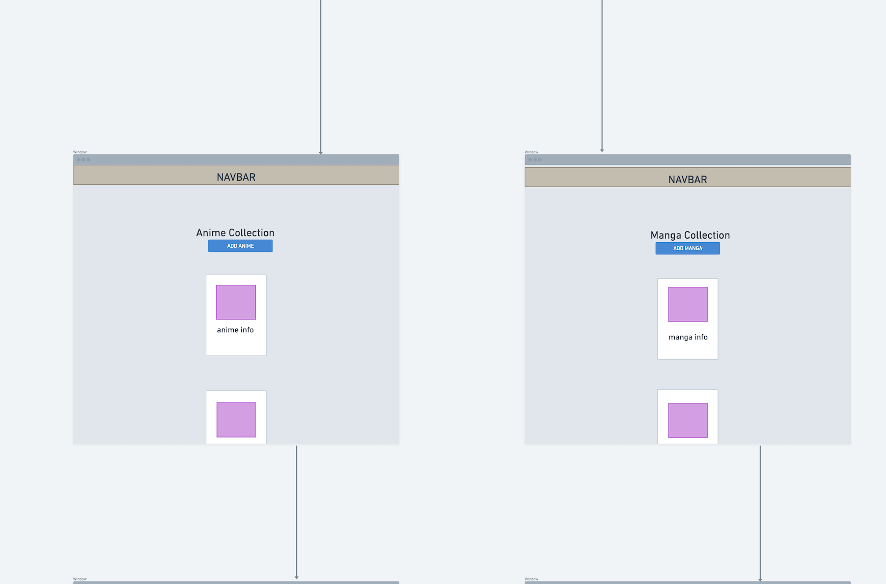
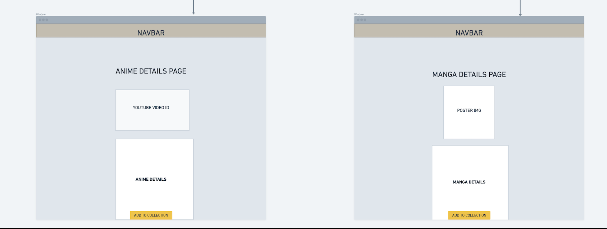
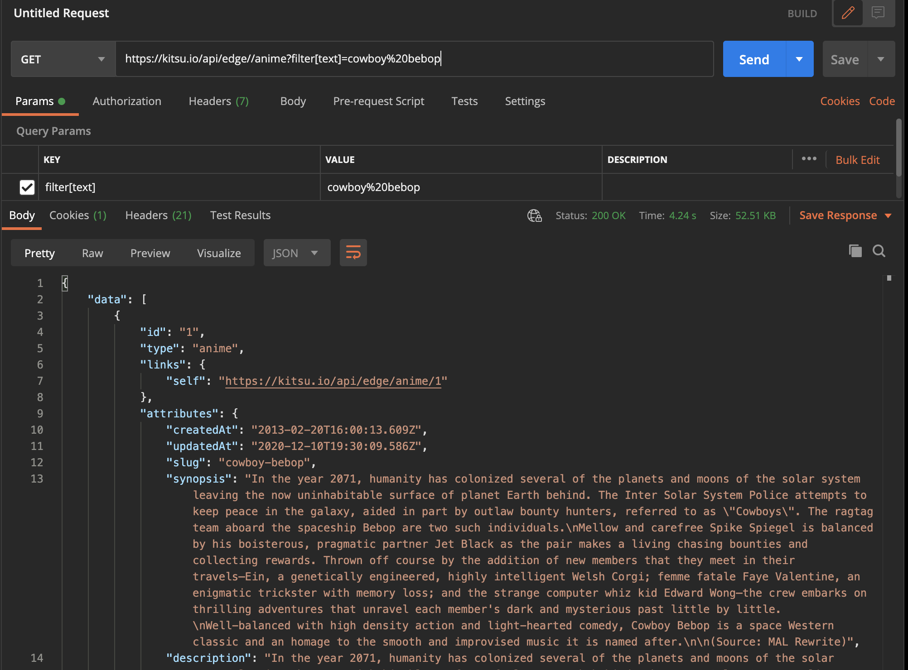
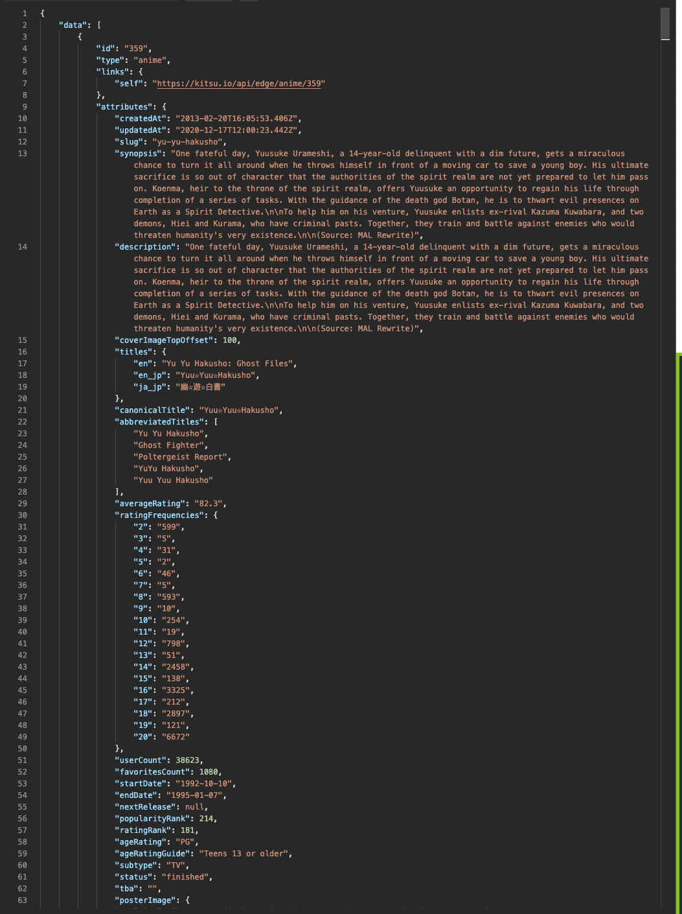

# AniApp

## WIREFRAMING:
### WIREFRAME IMAGES:

### POSTMAN TESTS FOR VALUES:

## DESCRIPTION
### OVERALL
This is AniApp. AniApp is a database of anime/manga (finished or active) that allows you to organize and sort through titles and watch trailers; making it easier to find titles that fit your interests. The interactive lounge area (when completed) is a great place to chill, listen to music and interact with other users to discuss current topics, titles, and plot lines. 
### PROFILE
The 'My Profile' section of this app allows you to view and manage personal info, change avatar image, and update bio/alias as well as viewing your friends list. The 'Users' section provides you with an up to date list of users with access to a 'User Details' page that displays name, when they joined, email, favorite anime and manga (icebox) by clicking on a respective users name.
## GETTING STARTED
<a href="https://trello.com/b/QRzfVDEe/unit-2-project">Trello</a> - This will direct you to my planning page 
<a href="https://ani-app2424.herokuapp.com/">AniApp</a> - This will prompt you to the deployed web app.
This will direct you to my planning page.

## INSTRUCTIONS
Login to Google to access the app. Enjoy the Lounge and interact with others (if lounge is finished by then.) Navigate to the anime or manga section to view your collection. If you dont have a collection, search for an anime/manga of your choice. If searching for an anime, feel free to enjoy the Youtube trailers for each respective show.

## TECHNOLOGIES USED:
- HTML
- CSS
- JavaScript
- Bootstrap
- Node.js
- Express.js
- Mongoose
- MongoDB
- Heroku
- EJS (Embedded Javascript)
- Google OAuth2
- Kitsu API
- Youtube
- Spotify
  
## NEXT STEPS:
- [ ] BETTER MOBILE RESPONSIVENESS (whole app)
- [ ] Reviews (Anime/Manga)
- [ ] Favorite Anime/Manga (users)(single)
- [ ] Interactive Lounge area (home)
- [ ] Live Message Board - Live Chat (socket.io - home)
- [ ] Anime/Manga Suggestions (3 - columns - home)
- [ ] Better Audio Source (VOLUME CONTROL - home)
- [ ] Multiple Playlists (home)

## ATTRIBUTIONS:
While the below disclaimers are technically required by their license-holders I would like to also sincerely thank all the creators whose work makes this site look great. I do not own or am associated with the resources used in any way, Thank you!
- Google Images
- Kitsu API
- Youtube
- Spotify

